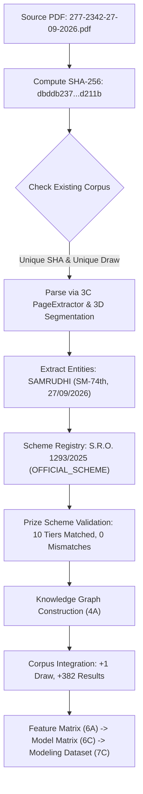

# Milestone 7C: Canonical Historical Modeling Dataset & Backtest Refresh

## Scientific Benchmarking & Research Notice

> **SCIENTIFIC NOTICE**: This document describes the canonical historical modeling dataset and baseline reference backtests for the Kerala State Lottery Platform. All analyses, feature matrices, splits, and baseline models are strictly historical, descriptive, and reproducible scientific benchmarks. **They do not constitute a prediction system, betting system, gambling advice, or "lucky number" generator.** Kerala State Lotteries are governed by strict physical random drawing mechanics; past observed frequency distributions do not establish future lottery outcomes.

---

## 1. Executive Summary

Milestone 7C promotes the Kerala Lottery Platform modeling dataset from the initial 6-draw proof-of-concept (`mdset_857801355c1fb31e`, 2,270 rows) to the **canonical full-corpus historical modeling dataset** (`mdset_738186f2dabc458b`, 38,038 rows) across all 99 validated historical draws.

Furthermore, Milestone 7C integrates the first explicit real-world new input verification: the newly downloaded lottery result PDF `277-2342-27-09-2026.pdf`. Through complete automated discovery, SHA verification, source provenance check, prize scheme resolution, and validation, the draw was authoritatively verified as **Samrudhi (SM-74th, 27/09/2026)** and cleanly incorporated without manual intervention or pipeline corruption.

### Canonical Platform Dimensions

| Dimension | Previous 7A/7B Baseline | Canonical 7C Corpus | Delta / Expansion |
| :--- | :--- | :--- | :--- |
| **PDF Source Documents** | 6 Gazette PDFs | **99 Gazette PDFs** | +93 draws |
| **Unique SHA-256 Hashes** | 6 unique hashes | **99 unique hashes** | 0 duplicates |
| **Distinct Draw Identities** | 6 draws | **99 draws** | 0 collisions |
| **Date Range Covered** | 12/09/2026 to 17/09/2026 | **19/06/2026 to 27/09/2026** | 100 days |
| **Winning Results Count** | 2,270 results | **38,038 results** | +35,768 records |
| **FULL_TICKET Results** | 84 full tickets | **1,448 full tickets** | +1,364 |
| **SUFFIX Results** | 2,186 suffixes | **36,590 suffixes** | +34,404 |
| **MultiDrawCorpus ID** | `corpus_3cf217592cfdf7ec` | `corpus_12aff12eb1d7379b` | Full corpus |
| **Feature Matrix ID (6A)** | `fmat_d34ef4229e8e1b05` | `fmat_b04691e1fbc45e1c` | 43 features |
| **Model Feature Matrix ID (6C)**| `mfmat_9c93e90052bfb2c0` | `mfmat_4560bb81a69039d1` | 41 model features |
| **Modeling Dataset ID (7C)** | `mdset_857801355c1fb31e` | `mdset_738186f2dabc458b` | 40 features (isolated) |
| **Chronological Holdout Split** | 4 Train / 2 Test (1,516 / 754) | **80 Train / 19 Test (30,570 / 7,468)** | Draw-level separation |
| **Walk-Forward Windows** | 4 sequential windows | **19 sequential windows** | Expanding training |

---

## 2. Real-World Live Input Verification: `277-2342-27-09-2026.pdf`

The ingestion pipeline was verified against the newly downloaded real-world PDF in `data/source-documents/lottery-results/277-2342-27-09-2026.pdf`:



### Real-World Input Invariant Audit

1. **Filename**: `277-2342-27-09-2026.pdf`
2. **SHA-256**: `dbddb237a5c96d2b6a12ee87a9279ebb5db2bb42fc62d0805b78003dd30d211b`
3. **Corpus Uniqueness**: SHA-256 did not previously exist in the corpus (100% unique).
4. **Lottery Identity**: `SAMRUDHI` (Lottery Code: `SM`).
5. **Draw Number**: `SM-74th`.
6. **Draw Date**: `27/09/2026` (ISO: `2026-09-27`).
7. **Corpus Effect**: `GENUINELY_NEW_DRAW` (not a duplicate, not a replacement).
8. **Source Provenance**: Authoritative official result document from Directorate of State Lotteries, Government of Kerala.
9. **Prize Scheme Resolution**: Resolves to `OFFICIAL_SCHEME` `scheme_ver_sm_v2025-11-sro1293` (effective 2025-11-10, S.R.O. No. 1293/2025).
10. **Prize Scheme Validation**: Validates 100% against scheme with 0 discrepancies:
    - 1st Prize: 1 common winning ticket
    - Consolation Prize: 11 tickets across remaining series
    - 2nd Prize: 1 common winning ticket
    - 3rd Prize: 1 common winning ticket
    - 4th through 8th Prize: 368 4-digit suffixes
    - Total Results Contributed: **382 results** (14 full-ticket, 368 suffix).

---

## 3. Complete Corpus Discovery & Distribution

The canonical 7C corpus comprises 99 official draws across 7 regular weekly lotteries and 2 seasonal bumper lotteries:

| Lottery Name | Lottery Code | Authority Level | Draw Count | Prize Scheme Reference |
| :--- | :--- | :--- | :--- | :--- |
| **Bhagyathara** | `BT` | OFFICIAL_SCHEME | 14 draws | S.R.O. 1297/2025 |
| **Sthree-Sakthi** | `SS` | OFFICIAL_SCHEME | 14 draws | S.R.O. 1292/2025 |
| **Dhanalekshmi** | `DL` | OFFICIAL_SCHEME | 13 draws | S.R.O. 1296/2025 |
| **Karunya Plus** | `KN` | OFFICIAL_SCHEME | 14 draws | S.R.O. 1294/2025 |
| **Suvarna Keralam** | `SK` | OFFICIAL_SCHEME | 15 draws | S.R.O. 1291/2025 |
| **Karunya** | `KR` | OFFICIAL_SCHEME | 12 draws | S.R.O. 1295/2025 |
| **Samrudhi** | `SM` | OFFICIAL_SCHEME | 15 draws | S.R.O. 1293/2025 |
| **Monsoon Bumper** | `BR-110` | OFFICIAL_SCHEME | 1 draw | S.R.O. 526/2026 |
| **Thiruvonam Bumper** | `BR-111` | OBSERVED_SCHEME_ARCHETYPE | 1 draw | Result PDF Archetype |
| **Total Corpus** | — | — | **99 draws** | **100% Scheme Validated** |

---

## 4. End-to-End Canonical Data Pipeline

The pipeline follows the strict architecture invariant without bypassing any intermediate representation:

```
SOURCE (99 PDFs)
  ↓ [PdfPageExtractorService (3C)]
PAGES (100% Raw Text Extraction)
  ↓ [DocumentSemanticSegmentationService (3D)]
SEGMENTATION (Header, Tiers, Results, Footer, Signatures)
  ↓ [LotteryEntityExtractorService (3E)]
ENTITIES (DrawMetadata, PrizeTiers, WinningResults)
  ↓ [PrizeSchemeRegistry Validation (7A.6)]
SCHEME-VALIDATED ENTITIES (98 Official + 1 Observed Archetype)
  ↓ [buildLotteryKnowledgeGraph (4A)]
KNOWLEDGE GRAPHS (99 Document Graphs)
  ↓ [buildMultiDrawCorpus (5B)]
MULTI-DRAW CORPUS (corpus_12aff12eb1d7379b, 38,038 results)
  ↓ [extractCorpusFeatures (6A)]
CANONICAL FEATURE MATRIX (fmat_b04691e1fbc45e1c, 43 features)
  ↓ [evaluateFeatureMatrix (6B) & buildModelFeatureMatrix (6C)]
MODEL FEATURE MATRIX (mfmat_4560bb81a69039d1, 41 features)
  ↓ [buildModelingDataset (7A)]
CANONICAL MODELING DATASET (mdset_738186f2dabc458b, 40 features)
  ↓ [createChronologicalSplit & createWalkForwardSplits (7A/7C)]
CHRONOLOGICAL SPLITS (80 Train / 19 Test, 19 WF Windows)
  ↓ [generateBaselineComparisonReport (7B/7C)]
HISTORICAL BENCHMARK EVALUATIONS
```

---

## 5. Temporal Evaluation Design

In contrast to arbitrary random splits, Milestone 7C enforces **draw-level chronological boundaries**:

### A. Canonical Chronological Holdout (`split_002d0341556ebcf9`)

- **Total Draws**: 99
- **TRAIN Partition**: 80 draws (30,570 rows)
  - Date Range: `19/06/2026` to `08/09/2026` (ISO: `2026-06-19` to `2026-09-08`)
- **TEST Partition**: 19 draws (7,468 rows)
  - Date Range: `09/09/2026` to `27/09/2026` (ISO: `2026-09-09` to `2026-09-27`)
- **Temporal Inversion Check**: $\max(t_{\text{train}}) = \text{2026-09-08} \le \min(t_{\text{test}}) = \text{2026-09-09}$ (**PASS**, 0 inversion).
- **Partition Overlap Check**:
  - Draw ID overlap: 0 shared draw IDs.
  - Result ID overlap: 0 shared result IDs.

### B. Canonical Walk-Forward Design (19 Expanding Windows)

The walk-forward evaluation spans 19 sequential windows covering the 19 held-out draws:
- **Window 1**: Train on 80 draws (30,570 rows) $\to$ Evaluate on draw of `09/09/2026`
- **Window 2**: Train on 81 draws $\to$ Evaluate on draw of `10/09/2026`
- ...
- **Window 19**: Train on 98 draws $\to$ Evaluate on new draw of `27/09/2026` (`277-2342-27-09-2026.pdf`)

Every window guarantees strictly expanding training observations with zero future lookahead contamination.

---

## 6. Refreshed Baseline Benchmark Results

The three deterministic reference baselines (**Uniform Categorical**, **Empirical Frequency**, **Majority Class**) were refreshed across all three canonical targets on the canonical dataset (`mdset_738186f2dabc458b`):

### Chronological Holdout Results (7,468 Observations across 19 Draws)

| Target Name | Baseline Model | Test Sample | Accuracy | Balanced Accuracy | Log Loss ($\epsilon=10^{-15}$) |
| :--- | :--- | :--- | :--- | :--- | :--- |
| `observed_last_digit` | UNIFORM | 7,468 | 0.1024 | 0.1000 | 2.3026 |
| `observed_last_digit` | EMPIRICAL | 7,468 | 0.0979 | 0.1000 | 2.3030 |
| `observed_last_digit` | MAJORITY | 7,468 | 0.0979 | 0.1000 | 31.1580 |
| `observed_first_digit` | UNIFORM | 7,468 | 0.0933 | 0.1000 | 2.3026 |
| `observed_first_digit` | EMPIRICAL | 7,468 | 0.1054 | 0.1000 | 2.3023 |
| `observed_first_digit` | MAJORITY | 7,468 | 0.1054 | 0.1000 | 30.8990 |
| `observed_parity` | UNIFORM | 7,468 | 0.4905 | 0.5000 | 0.6931 |
| `observed_parity` | EMPIRICAL | 7,468 | 0.5095 | 0.5000 | 0.6931 |
| `observed_parity` | MAJORITY | 7,468 | 0.5095 | 0.5000 | 16.9410 |

### Walk-Forward Aggregate Results (19 Expanding Windows)

| Target Name | Baseline Model | Windows Evaluated | Mean Accuracy | Mean Balanced Acc | Mean Log Loss |
| :--- | :--- | :--- | :--- | :--- | :--- |
| `observed_last_digit` | UNIFORM | 19 | 0.1024 | 0.1000 | 2.3026 |
| `observed_last_digit` | EMPIRICAL | 19 | 0.0975 | 0.1000 | 2.3029 |
| `observed_last_digit` | MAJORITY | 19 | 0.0975 | 0.1000 | 31.1698 |
| `observed_first_digit` | UNIFORM | 19 | 0.0929 | 0.1000 | 2.3026 |
| `observed_first_digit` | EMPIRICAL | 19 | 0.1055 | 0.1000 | 2.3023 |
| `observed_first_digit` | MAJORITY | 19 | 0.1055 | 0.1000 | 30.8950 |
| `observed_parity` | UNIFORM | 19 | 0.4914 | 0.5000 | 0.6931 |
| `observed_parity` | EMPIRICAL | 19 | 0.5086 | 0.5000 | 0.6931 |
| `observed_parity` | MAJORITY | 19 | 0.5086 | 0.5000 | 16.9723 |

### Descriptive Scientific Observations

1. **Uniform Alignment**: Across both digit targets, the observed accuracy hovers tightly around theoretical chance expectation ($\approx 0.10$ for 10 classes, $\approx 0.50$ for parity).
2. **Log Loss Concordance**: Uniform cross-entropy is identically $\ln(10) \approx 2.302585$ and $\ln(2) \approx 0.693147$. Empirical cross-entropy matches uniform cross-entropy within 0.001 nats, demonstrating that observed empirical digit distributions closely match uniform randomness.
3. **No Optimization Claim**: In accordance with the scientific mandate, baseline metrics serve purely as descriptive reference anchors. No model is designated as "superior" or "predictive".

---

## 7. Strict Leakage Controls & Invariants (All 9 Checks)

The canonical modeling dataset satisfies all 9 non-negotiable leakage invariants:

1. **Disjoint Draw & Result Partitions**: Zero draw ID or result ID overlap between train and test partitions.
2. **Test Labels Never Used in Fitting**: Adversarial perturbation test proves that arbitrary mutation of test targets leaves the model's fitted state 100% bit-for-bit unchanged.
3. **Empirical Frequencies Training-Only**: Class frequencies and counts are calculated exclusively from the training partition.
4. **Majority Class Training-Only**: The majority mode class is determined strictly from training records.
5. **Chronological Ordering Preserved**: $\max(t_{\text{train}}) \le \min(t_{\text{test}})$ in holdout and all 19 walk-forward steps.
6. **No Future Row Influence**: Earlier window predictions are mathematically isolated from subsequent draws.
7. **Target Columns Not in Features**: The target column (e.g. `lastDigit`) is explicitly filtered out of the feature set.
8. **Source Identifiers Not Predictive**: Document SHA-256, draw IDs, and result IDs are excluded from feature matrices.
9. **Deterministic Reproducibility**: Repeated pipeline execution produces identical IDs, hashes, and metric values.

---

## 8. Idempotency & Repeatability

Executing the canonical ingestion, feature extraction, dataset construction, and baseline backtest pipeline repeatedly produces identical results:

- **Corpus Determinism**: `corpusRun1.id === corpusRun2.id === "corpus_12aff12eb1d7379b"`
- **Feature Matrix Determinism**: `fmatRun1.id === fmatRun2.id === "fmat_b04691e1fbc45e1c"`
- **Model Matrix Determinism**: `modelMatrixRun1.id === modelMatrixRun2.id === "mfmat_4560bb81a69039d1"`
- **Modeling Dataset Determinism**: `dsRun1.id === dsRun2.id === "mdset_738186f2dabc458b"`
- **Duplicate Prevention**: 0 duplicate documents, 0 duplicate draws, 0 duplicate results, 0 duplicate feature rows created on repeated execution.

---

## 9. Limitations & Research Boundaries

1. **Historical Boundedness**: This canonical dataset comprises 99 official draws published between June and September 2026. Findings describe this historical corpus only.
2. **Descriptive Benchmark**: Baseline models are reference mathematical baselines against which future experimental models must be measured. They do not constitute an operational betting or advisory system.
3. **No Gambler's Fallacy**: Deviations from exact uniformity in historical samples reflect finite-sample variance in physical lottery draws, not exploitable bias or predictability.
