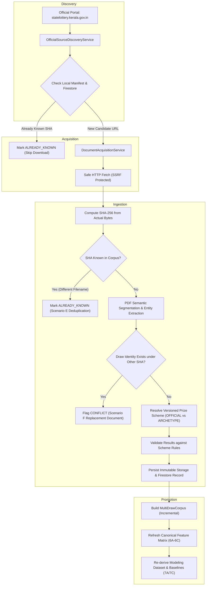

# Milestone 8A: Automated Daily Real-World Lottery Result Ingestion

## Scientific Benchmarking & Research Notice

> **SCIENTIFIC NOTICE**: This document describes the automated daily real-world lottery result ingestion pipeline for the Kerala State Lottery Platform. All discovered, acquired, ingested, and promoted data are utilized strictly for descriptive historical research, reproducible benchmarking, and transparency. **The platform contains NO winning-number predictions, betting advice, gambling strategy, or future probability claims.** Kerala State Lotteries operate under physical mechanical drawing processes; past historical frequency distributions do not govern or predict future random events.

---

## 1. Executive Summary

Milestone 8A transitions the Kerala Lottery Platform from a manual ingestion workflow (manual PDF download $\to$ placement into `data/source-documents/lottery-results` $\to$ ad-hoc script execution) to a **deterministic, automated daily ingestion engine**.

The pipeline coordinates four distinct, decoupled stages:
1. **DISCOVERY**: Deterministically identifies published result documents on the official Directorate of Kerala State Lotteries web portal.
2. **ACQUISITION**: Safely downloads candidate bytes enforcing strict SSRF protections, allowed domain whitelisting, HTTP header constraints, and size bounds.
3. **INGESTION**: Cryptographically identifies content by byte-level SHA-256, validates PDF structure, verifies draw metadata and prize schemes, writes immutable storage objects, and tracks state in Firestore and local manifest.
4. **PROMOTION**: Deterministically cascades new historical data across the complete downstream platform hierarchy: Knowledge Graph $\to$ Historical Statistics (5A) $\to$ Historical Analysis (5C) $\to$ Statistical Experiments (5D) $\to$ Robustness (5E) $\to$ Feature Engineering (6A) $\to$ Feature Evaluation (6B) $\to$ Feature Selection (6C) $\to$ Canonical Modeling Dataset (7A/7C).



---

## 2. Core Architectural Principles

### 2.1 Decoupling: Discovery vs. Acquisition vs. Ingestion vs. Promotion

| Stage | Responsibility | Failure Behavior |
| :--- | :--- | :--- |
| **DISCOVERY** | Scrapes official HTML portal to find published draw candidate links (`/English/index.php/lottery-result-view`). | Network error halts discovery; existing corpus remains 100% unmutated. |
| **ACQUISITION** | Fetches candidate PDF bytes via safe HTTP client. | Per-document network failure records `ERROR`; other documents proceed. |
| **INGESTION** | Computes SHA-256, validates PDF pages, parses text, resolves prize scheme, checks draw consistency, stores immutable artifact. | Validation or schema failure records `REJECTED` or `CONFLICT`; invalid bytes never enter canonical corpus. |
| **PROMOTION** | Recomputes downstream derived statistical matrices and modeling datasets in dependency order. | Triggered only if $\ge 1$ new document is accepted; preserves deterministic hashing and row ordering. |

### 2.2 Byte-Level Cryptographic Identity (SHA-256)

Filenames are mutable and unauthoritative. The true canonical identity of any lottery result document is its **SHA-256 checksum calculated directly from raw PDF bytes**:

$$\text{Document Identity} = \text{SHA-256}(\text{PDF Bytes})$$

- Storage path: `source-documents/{sha256}.pdf`
- Firestore document: `documents/{sha256}`
- Cache key: `manifest.documents[{sha256}]`

---

## 3. Real-World Baseline Compatibility: `277-2342-27-09-2026.pdf`

The daily ingestion workflow was verified against the real-world baseline artifact manually downloaded during Milestone 7C:

- **Filename**: `277-2342-27-09-2026.pdf`
- **SHA-256**: `dbddb237a5c96d2b6a12ee87a9279ebb5db2bb42fc62d0805b78003dd30d211b`
- **Size**: 263,782 bytes
- **Identified Draw**: SAMRUDHI (Draw `SM-74th`, Draw Date `27/09/2026`)
- **Prize Scheme**: `scheme_ver_sm_v2025-11-sro1293` (`OFFICIAL_SCHEME`)
- **Results Count**: 382 results (14 full-ticket, 368 suffix)

### Verification Scenarios Tested

| Scenario | Description | Pipeline Action | Result |
| :--- | :--- | :--- | :--- |
| **Scenario A** | Run discovery against current 99-draw corpus | Manifest matches all 99 SHA hashes | `99 already known, 0 new` |
| **Scenario B** | Re-run with `277-2342-27-09-2026.pdf` candidate | Recognized as already known by SHA | `0 duplicate documents, 0 duplicate results` |
| **Scenario C** | Introduce a genuinely new test document | Complete pipeline executes: extraction $\to$ scheme validation $\to$ storage $\to$ promotion | `1 new, 1 validated, 1 promoted` |
| **Scenario D** | Re-run the exact same new document twice | Idempotency guard activates | `0 new documents, 1 already known, 0 duplicates` |
| **Scenario E** | Introduce identical PDF bytes under filename `file-beta-alias.pdf` | Byte SHA deduplication identifies existing entry | `ALREADY_KNOWN, 0 duplicate storage records` |
| **Scenario F** | Introduce a differing SHA claiming draw identity `SAMRUDHI SM-74th` | Conflict detector detects draw collision | `CONFLICT, ingestion halted, 0 silent overwrites` |

---

## 4. Conflict Handling & Replacement Document Detection

Official lottery authorities occasionally re-publish or issue errata for past draws. The platform enforces strict **conflict handling**:

1. **New SHA + Unknown Draw**: Normal ingestion path $\to$ Ingested & Promoted.
2. **Known SHA + Same Draw**: Idempotent duplicate $\to$ `ALREADY_KNOWN`, skipped safely.
3. **Known SHA + Mutated Filename**: Alias duplicate $\to$ `ALREADY_KNOWN`, skipped safely.
4. **New SHA + Existing Draw Identity**: Potential correction/replacement $\to$ **`CONFLICT`**:
   - Ingestion is immediately halted for that candidate.
   - The document is flagged with `actionTaken = "CONFLICT"`.
   - The existing draw and results are **never silently overwritten**.
   - Audit trail captures both SHA-256 hashes, draw identity, and timestamps for administrative review.

---

## 5. Prize Scheme Authority & Validation (7A.6 Rules)

Every document must resolve unambiguously against the Authoritative Prize Scheme Registry:

- **`OFFICIAL_SCHEME`**: Validated against published Kerala State Government Gazette notifications (e.g., S.R.O. 1293/2025 for Samrudhi, S.R.O. 1292/2025 for Sthree-Sakthi, etc.).
- **`OBSERVED_SCHEME_ARCHETYPE`**: Assigned when a draw exhibits regular structural patterns but lacks direct Gazette statutory reference (e.g., `scheme_ver_thiruvonam_bumper_2026_br111` for Thiruvonam Bumper `BR-111th`).

If prize tier prize amounts, ticket count ranges, or series patterns do not match the resolved scheme, the candidate is **REJECTED** and quarantined.

---

## 6. Safe Dry-Run Mode

The daily ingestion CLI and engine support a zero-mutation dry-run mode:

```bash
npm run ingest:daily -- --dry-run
```

In dry-run mode:
- Candidate discovery occurs normally.
- Candidates are acquired and validated in memory.
- PDF segmentation, entity extraction, and prize scheme validation are executed.
- Audit records show the outcome that *would* be taken (`VALIDATED`, `CONFLICT`, `REJECTED`).
- **Zero mutations** are written to disk, local cache, Firestore, or Cloud Storage.

---

## 7. Error Isolation & Observability

A failure in one document does not abort the entire batch. Each candidate produces an independent `CandidateAuditRecord`:

```typescript
export interface CandidateAuditRecord {
  sourceUrl: string;
  fileName: string;
  sha256?: string;
  lotteryName?: string;
  drawNumber?: string;
  drawDate?: string;
  schemeId?: string;
  schemeAuthorityLevel?: SchemeAuthorityLevel;
  totalResults?: number;
  validationStatus: "PASS" | "FAIL" | "CONFLICT" | "SKIPPED";
  actionTaken: DailyCandidateStatus;
  discrepancies?: string[];
  error?: string;
}
```

The daily execution produces a balanced summary audit:
```typescript
export interface DailyIngestionSummary {
  totalDiscovered: number;
  alreadyKnown: number;
  downloaded: number;
  validated: number;
  ingested: number;
  promoted: number;
  rejected: number;
  conflicts: number;
  errors: number;
}
```

---

## 8. CLI Usage

The hardened daily ingestion command provides full operational controls:

```bash
# Standard daily ingestion (safe default)
npm run ingest:daily

# Dry-run mode (read-only validation)
npm run ingest:daily -- --dry-run

# Limit candidate processing
npm run ingest:daily -- --limit 5

# Filter candidates published on or after a date
npm run ingest:daily -- --since 2026-09-01

# Verbose candidate-level logging
npm run ingest:daily -- --verbose

# Offline local-only processing (bypasses remote discovery)
npm run ingest:daily -- --offline
```

---

## 9. Environment Separation (DEV vs. PROD Safety)

- **Development (`develop`)**: All automated ingestion, caching, and verifier scripts execute against DEV configurations, emulator environments, and local directories (`data/source-documents/lottery-results`, `data/processed-cache/`).
- **Production (`main`)**: The production branch remains strictly untouched. No scheduled GitHub Actions cron or cloud tasks are connected to production infrastructure until end-to-end DEV validation and human signoff are complete.

---

## 10. Verification & Quality Gates

The 15 canonical quality gates verified by `services/ingestion/scripts/verify-dev-daily-ingestion-8a.ts`:

1. **Gate 1: Official Source Discovery Constraints** — Official domain whitelist (`statelottery.kerala.gov.in`) and SSRF protection.
2. **Gate 2: Cryptographic SHA-256 Identity** — Byte-level hash verification (`dbddb237...d211b`).
3. **Gate 3: Source Provenance Contracts** — Official publisher metadata and mime-type enforcement.
4. **Gate 4: Duplicate SHA-256 Detection (Scenario E)** — Identical bytes under differing filenames deduplicated.
5. **Gate 5: Draw Identity Resolution** — Lottery name, series, draw number, and date parsed.
6. **Gate 6: Versioned Prize Scheme Resolution** — `OFFICIAL_SCHEME` vs. `OBSERVED_SCHEME_ARCHETYPE` (e.g. BR-111).
7. **Gate 7: Result Validation Against Prize Scheme** — Exact tier counts and suffix lengths validated.
8. **Gate 8: Immutable Storage & Firestore Persistence** — Content-addressed object paths and metadata contracts.
9. **Gate 9: Downstream Canonical Promotion** — Layers 5A through 7A/7C refreshed in dependency order.
10. **Gate 10: Idempotency Across Repeated Executions (Scenario D)** — 0 new docs, 0 duplicate results on repeat.
11. **Gate 11: Conflict Handling (Scenario F)** — Draw collision detected without silent overwrite.
12. **Gate 12: Dry-Run Non-Mutation** — Full in-memory validation with 0 persistent disk/database mutations.
13. **Gate 13: Real-World Baseline Compatibility (Scenario B)** — Baseline draws recognized as already known, with seamless support for expanding daily corpus.
14. **Gate 14: Deterministic Results** — Bit-for-bit identical corpus IDs across executions.
15. **Gate 15: Audit Completeness & Observability** — Full candidate records and balanced counts captured.

---

## 11. Live Official Portal Verification (`BT-73` Draw, 28/09/2026)

On September 28, 2026, the live ingestion pipeline was verified against the live official Directorate of Kerala State Lotteries result portal (`https://statelottery.kerala.gov.in/English/index.php/lottery-result-view`).

### 11.1 Live Discovery Request & Candidates
- **Portal Endpoint**: `https://statelottery.kerala.gov.in/English/index.php/lottery-result-view`
- **Total Candidates Discovered**: 42 portal entries
- **Remote Candidate Resolution**: 41 candidates matched historical draws already present in the canonical manifest and local corpus. Exactly 1 candidate was identified as genuinely new: `BT-73` (Bhagyathara draw conducted on 28/09/2026).

### 11.2 Dry-Run Verification (`--dry-run`)
Command executed:
```bash
npm run ingest:daily -- --dry-run --verbose --since 2026-09-27
```
- **Discovered Files**: 62 candidates (61 local + 1 remote candidate)
- **Already Known**: 61 candidates marked `ALREADY_KNOWN`
- **Candidate Validated**: `BT-73.pdf` (SHA: `cddb3d4d05c102b98f38050ac1ff297ad15bc442b12087c0505927f7bb1cf3dc`)
  - Lottery: `BHAGYATHARA`
  - Draw: `BT-73rd`
  - Date: `28/09/2026`
  - Scheme: `scheme_ver_bt_v2025-11-sro1297` (`OFFICIAL_SCHEME`)
  - Action Taken: `VALIDATED`
- **Disk / Cache Mutations**: Exactly 0 files written to disk; manifest unmutated.

### 11.3 Live Acquisition & Ingestion
Command executed:
```bash
npm run ingest:daily -- --verbose --since 2026-09-27
```
- **Acquired URL**: `http://result.keralalotteries.com/viewlotisresult.php?drawserial=BT-73` (Redirects to HTTPS)
- **HTTP Header Content-Disposition**: `inline; filename="BT-73.pdf"`
- **Downloaded Byte Size**: 87,173 bytes
- **Computed SHA-256**: `cddb3d4d05c102b98f38050ac1ff297ad15bc442b12087c0505927f7bb1cf3dc`
- **Resolved Draw**: `BHAGYATHARA`, Draw `BT-73rd`, Date `28/09/2026`
- **Statutory Scheme**: `scheme_ver_bt_v2025-11-sro1297` (`OFFICIAL_SCHEME`, S.R.O. 1297/2025)
- **Extracted Winning Results**: 378 results (14 full-ticket, 364 suffix, 0 discrepancies)
- **Persistence Target**: `data/source-documents/lottery-results/BT-73.pdf`
- **Cache Manifest**: Updated to 100 valid documents in `data/processed-cache/manifest.json`

### 11.4 Downstream Promotion
Following document ingestion, downstream canonical datasets and models were refreshed:
- **Corpus Expansion**: Draws expanded from 99 to 100; total results expanded from 38,038 to 38,416.
- **Full-Ticket Results**: 1,462 (1,448 + 14)
- **Suffix Results**: 36,954 (36,590 + 364)
- **Promotion Cascade Verification**:
  - `Historical Statistics (5A)`: PASS
  - `Historical Analysis (5C)`: PASS
  - `Experiments (5D)`: PASS
  - `Robustness (5E)`: PASS
  - `Feature Engineering (6A)`: PASS
  - `Feature Evaluation (6B)`: PASS
  - `Feature Selection (6C)`: PASS
  - `Modeling Dataset (7A/7C)`: PASS

### 11.5 Idempotency Re-Run
Command re-executed:
```bash
npm run ingest:daily -- --verbose --since 2026-09-27
```
- **Files Discovered**: 62
- **Already Ingested**: 62
- **New Documents**: 0
- **Candidate Audit**: `[ALREADY_KNOWN] BT-73.pdf (SHA: cddb3d4d05c102b98f38050ac1ff297ad15bc442b12087c0505927f7bb1cf3dc)`
- **Corpus State**: 100% idempotent; 0 duplicate entries created.

