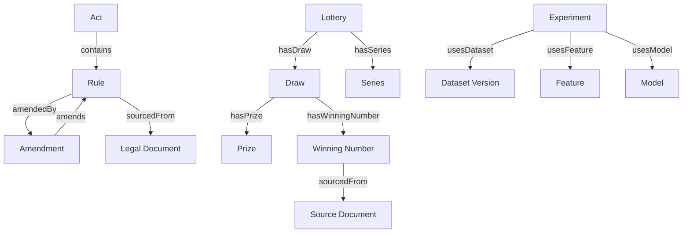

# Knowledge Graph Specification

## Concept
The platform models statutory legal frameworks, administrative lottery operations, and empirical draw results as a connected knowledge graph.

---

## Entity Types
1. **Act**: Primary legislation (e.g. The Lotteries (Regulation) Act, 1998).
2. **Rule**: Delegated rules (e.g. The Kerala Paper Lotteries (Regulation) Rules, 2005).
3. **Amendment**: Official gazette notifications (S.R.O.) amending rules.
4. **LegalDocument**: Published gazette issue.
5. **Form**: Statutory prize claim forms (Form I, Form II, etc.).
6. **Lottery**: Recurring lottery brand (Win-Win, Karunya, Fifty Fifty, etc.).
7. **Scheme**: Ticket pricing and prize schedule for a lottery.
8. **Draw**: Specific draw event on a specific date.
9. **Prize**: Prize tier structure.
10. **WinningNumber**: Specific ticket number drawn.
11. **Series**: Two-letter prefix series (e.g. WA, WB, WC).
12. **Dataset**: Versioned snapshot of verified draws.
13. **Experiment**: Model backtest run.
14. **Feature**: Mathematical feature definition.

---

## Graph Relationships

---

## Temporal Rule Integrity
Historical amendments **never** overwrite prior rules. Each rule record contains:
- `effectiveFrom`: Date when the rule came into legal force.
- `effectiveTo`: Date when superseded or repealed (or null if currently active).
- `amendmentHistory`: Array of amendment IDs.
This ensures legal queries for historical draws (e.g. in 2008) evaluate against the legal rules in effect on that exact date.
