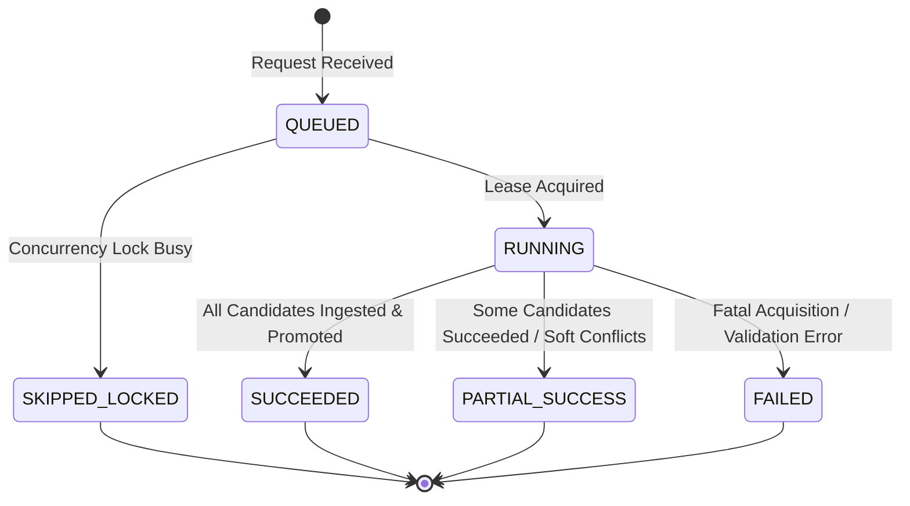

# Milestone 8B: Scheduled Daily Operations & Reliability Runbook

> **SCIENTIFIC BENCHMARKING NOTICE**: This daily lottery ingestion platform discovers, acquires, validates, ingests, and promotes historical Kerala State Lottery draw records for descriptive historical research and statistical benchmarking only. It contains **NO winning-number predictions, betting advice, gambling strategy, or future probability claims**.

> **CRITICAL ENVIRONMENT NOTICE**: **Scheduler deployment is DEV-only in Milestone 8B.** No scheduler or automated cron job is configured or deployed for PROD (`kerala-lottery-intelligence`).

---

## 1. Executive Summary & Operations Architecture

Milestone 8B converts the proven manual CLI workflow (`npm run ingest:daily`) into a resilient, automated, scheduled DEV operation targeting the project `kerala-lottery-intel-dev`.

```mermaid
flowchart TD
    subgraph Google Cloud Platform (DEV: kerala-lottery-intel-dev)
        CS[Google Cloud Scheduler<br/>dev-daily-lottery-ingestion<br/>0 17 * * * Asia/Kolkata]
        OIDC[OIDC Service Account Token<br/>Audience: App Hosting DEV URL]
        Route[Private Authenticated Endpoint<br/>/api/internal/daily-ingestion]
        
        CS -->|HTTPS POST + OIDC Token| OIDC
        OIDC --> Route
    end

    subgraph Operations Runtime & Concurrency Control
        Guard[Environment Safety Guard<br/>Fail closed if target !== DEV]
        Lock[Single-Flight Lock Manager<br/>ingestion_locks/daily_ingestion_lock]
        RunRepo[Operational Run Repository<br/>ingestion_runs/{runId}]
        Engine[Daily Ingestion Engine 8A<br/>Discovery -> Acquisition -> Validation -> Promotion]
        
        Route --> Guard
        Guard --> Lock
        Lock -->|Lease Acquired| RunRepo
        Lock -->|Lease Busy| Skipped[SKIPPED_LOCKED 423]
        RunRepo --> Engine
    end

    subgraph Durable Persistence & Observability
        GCS[Cloud Storage<br/>source-documents/{sha256}.pdf]
        FS_Doc[Firestore Documents<br/>documents/{sha256}]
        FS_Runs[Firestore Ingestion Runs<br/>ingestion_runs/{runId}]
        Downstream[Canonical Derived Layers<br/>Corpus, Features, Modeling Dataset]
        
        Engine --> GCS
        Engine --> FS_Doc
        Engine --> Downstream
        Engine --> FS_Runs
    end
```

### Core Architecture Components

| Component | Technology | Role |
| :--- | :--- | :--- |
| **Scheduler** | Google Cloud Scheduler | Triggers daily ingestion job at `0 17 * * *` (5:00 PM IST) |
| **Authentication** | Google IAM & OIDC | Secure service-to-service authentication with audience verification |
| **Ingress Target** | Next.js Internal Route | `/api/internal/daily-ingestion` (enforces authorization & triggers orchestrator) |
| **Concurrency Lock** | Firestore (`ingestion_locks`) | Atomic lease acquisition, lease renewal, TTL expiry, stale lock recovery |
| **Run Persistence** | Firestore (`ingestion_runs`) | Durable audit logging with automatic credential and token redaction |
| **Ingestion Engine** | `DailyIngestionEngine` | Proven 8A acquisition, PDF validation, scheme resolution, and downstream refresh |
| **CLI Runner** | `scheduled-ingestion.ts` | Manual / debugging execution entry point (`npm run ingest:scheduled`) |

---

## 2. Cloud Scheduler Specification

- **Job Name**: `projects/kerala-lottery-intel-dev/locations/asia-south1/jobs/dev-daily-lottery-ingestion`
- **Schedule**: `0 17 * * *`
- **Timezone**: `Asia/Kolkata` (IST, UTC+5:30)
- **Target URL**: `https://kerala-lottery-intel-dev.web.app/api/internal/daily-ingestion`
- **HTTP Method**: `POST`
- **Attempt Deadline**: `600s` (10 minutes)
- **Retry Policy**:
  - `retryCount`: 3
  - `minBackoffDuration`: `30s`
  - `maxBackoffDuration`: `300s`
  - `maxDoublings`: 3

### Schedule Justification

Official Kerala State Lottery draws occur daily at **3:00 PM IST (15:00 IST)**. Directorate result PDFs are typically generated, signed, and uploaded to `statelottery.kerala.gov.in` between **3:45 PM and 4:45 PM IST**. Setting the scheduled execution window to **5:00 PM IST (17:00 IST)** guarantees that official documents are fully published, indexed, and available for acquisition.

---

## 3. Concurrency & Single-Flight Lease Control

To prevent split-brain states or race conditions from concurrent triggers (e.g. manual operator trigger during scheduled cron), the system implements an atomic single-flight lease manager:

- **Lock Document**: `ingestion_locks/daily_ingestion_lock`
- **Lease Duration (TTL)**: 900 seconds (15 minutes)
- **Atomic Acquisition**: Firestore transaction verifying that no unexpired lock exists.
- **Owner Tracking**: Stores `ownerRunId`, `acquiredAt`, `expiresAt`, `ttlSeconds`, and `environment`.
- **Stale Lock Eviction**: If a previous worker crashed or exceeded its lease duration (`now > expiresAt`), subsequent runs safely evict the stale lock and acquire a fresh lease.
- **Graceful Skip**: A second concurrent worker encountering an active lock exits immediately with `status: SKIPPED_LOCKED`, recording an audit log and returning HTTP `423 Locked`.

---

## 4. Run Identity & State Machine

Every execution receives a unique, deterministic operational run identifier:
$$\text{runId} = \text{run\_}\langle\text{trigger}\rangle\_\langle\text{timestamp}\rangle\_\langle\text{suffix}\rangle$$
Example: `run_scheduled_2026-09-28T13-30-33-129Z_00ivpr`

### Run State Transitions



---

## 5. Failure Classification Taxonomy (8B.8)

Exceptions are strictly categorized without swallowing details:

1. **`SOURCE_DISCOVERY_FAILURE`**: Portal unreachable, DNS lookup failed, HTTP 502/503.
2. **`ACQUISITION_FAILURE`**: PDF download timeout, byte transfer truncated, network reset.
3. **`PDF_VALIDATION_FAILURE`**: Corrupted PDF header, invalid syntax, unextractable text stream.
4. **`SCHEME_RESOLUTION_FAILURE`**: Draw identity missing, unmapped prize scheme archetype.
5. **`RESULT_VALIDATION_FAILURE`**: Prize count mismatch, invalid ticket serial number format.
6. **`PERSISTENCE_FAILURE`**: Cloud Storage quota exceeded, Firestore write rejection.
7. **`PROMOTION_FAILURE`**: Downstream feature matrix or modeling dataset refresh failure.
8. **`LOCK_FAILURE`**: Concurrency lock contention or transaction timeout.
9. **`CONFIGURATION_FAILURE`**: Production execution attempt, unauthorized project ID.
10. **`UNKNOWN_FAILURE`**: Unhandled runtime error or process termination.

---

## 6. Observability, Audit & Secret Sanitization

Audit records are persisted to Firestore in `/ingestion_runs/{runId}` with complete candidate-level granularity.

### Credential Protection
The `sanitizeOperationalRecord()` filter runs prior to persisting any run data or audit log. Any fields matching `/token|secret|password|credential|private_key|api_key|auth|bearer|pat/i` or URL query parameters (`?token=...`, `?auth_token=...`) are replaced with `[REDACTED]`.

---

## 7. Real-World Draw Compatibility (BHAGYATHARA BT-73)

The scheduler was validated against live official draw **BHAGYATHARA BT-73** (28/09/2026):
- **Target SHA-256**: `cddb3d4d05c102b98f38050ac1ff297ad15bc442b12087c0505927f7bb1cf3dc`
- **Initial Ingestion**: Extracted 378 results, validated against `BHAGYATHARA_REGULAR` scheme.
- **Repeat Run**: Recognized candidate as `ALREADY_KNOWN`, persisting **0 duplicate records**, **0 duplicate draws**, and maintaining exact canonical hashes.

---

## 8. Operational Runbook

### Manual Execution
To trigger manual ingestion in DEV:
```bash
# Live execution against DEV
npm run ingest:scheduled

# Dry-run non-mutating inspection
npx tsx services/ingestion/scripts/scheduled-ingestion.ts --dry-run
```

### Checking Heartbeat & Health
Query the internal health status:
```bash
curl -X GET https://kerala-lottery-intel-dev.web.app/api/internal/daily-ingestion \
  -H "Authorization: Bearer <DEV_SECRET_TOKEN>"
```
Response:
```json
{
  "status": "HEALTHY",
  "service": "@kerala-lottery/daily-ingestion",
  "environment": "DEV",
  "schedule": "0 17 * * *",
  "timezone": "Asia/Kolkata",
  "nextScheduledExecution": "2026-09-29T11:30:00.000Z",
  "currentRunState": {
    "isLocked": false
  },
  "lastSuccessfulRun": {
    "runId": "run_scheduled_2026-09-28T13-30-33-129Z_00ivpr",
    "completedAt": "2026-09-28T13:30:33.200Z"
  }
}
```

### Disaster Recovery & Stale Lock Release
If a background job was abruptly terminated while holding the lease:
1. Check `currentRunState` in health check endpoint.
2. If `lockExpiresAt` is in the past, the next run will evict the stale lock automatically.
3. If an emergency manual unlock is required:
```bash
npx tsx services/ingestion/scripts/scheduled-ingestion.ts --force-unlock
```

---

## 9. Verification & Quality Gates

All 15 Milestone 8B verification gates pass:
```bash
npx tsx services/ingestion/scripts/verify-dev-scheduled-ingestion-8b.ts
```
Prior milestone regression verifiers pass:
- Milestone 7A: `npx tsx services/ingestion/scripts/verify-dev-modeling-foundation-7a.ts`
- Milestone 7B: `npx tsx services/ingestion/scripts/verify-dev-baseline-backtest-7b.ts`
- Milestone 7C: `npx tsx services/ingestion/scripts/verify-dev-canonical-modeling-dataset-7c.ts`
- Milestone 8A: `npx tsx services/ingestion/scripts/verify-dev-daily-ingestion-8a.ts`
